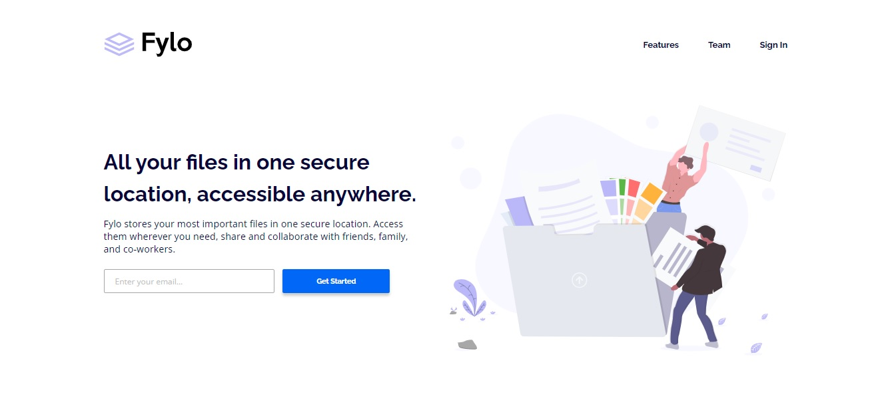
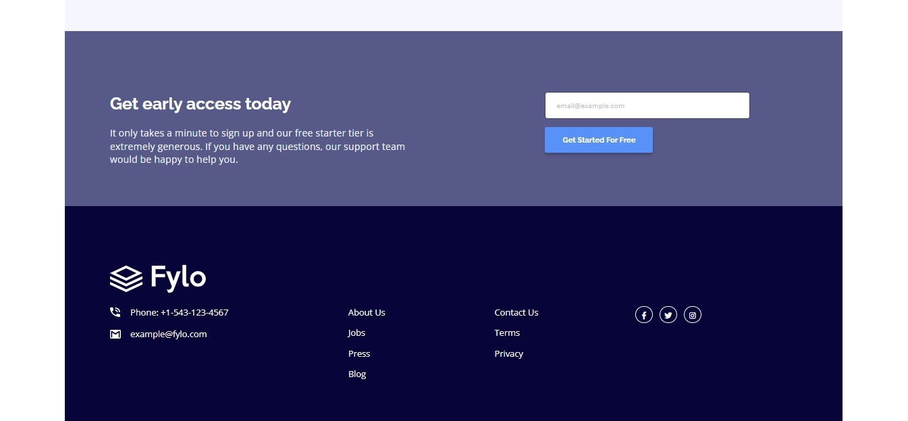
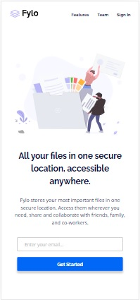
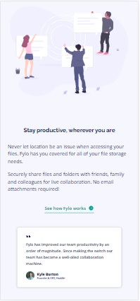

# Frontend Mentor - Fylo landing page with two column layout solution

This is a solution to the [Fylo landing page with two column layout challenge on Frontend Mentor](https://www.frontendmentor.io/challenges/fylo-landing-page-with-two-column-layout-5ca5ef041e82137ec91a50f5). Frontend Mentor challenges help you improve your coding skills by building realistic projects.

## Table of contents

- [Overview](#overview)
  - [The challenge](#the-challenge)
  - [Screenshot](#screenshot)
  - [Links](#links)
- [My process](#my-process)
  - [Built with](#built-with)
  - [What I learned](#what-i-learned)
  - [Continued development](#continued-development)
  - [Useful resources](#useful-resources)
- [Author](#author)
- [Acknowledgments](#acknowledgments)

## Overview

### The challenge

Users should be able to:

- View the optimal layout for the site depending on their device's screen size
- See hover states for all interactive elements on the page

### Screenshots

| Desktop layout |
|:--:|
 

| Mobile layout |
|:--:|
 

### Links

- Solution URL: https://github.com/PavlinaPs/fylo-landing-page-with-two-column-layout
- Live Site URL: https://pavlinaps.github.io/fylo-landing-page-with-two-column-layout/

## My process

### Built with

- Semantic HTML5 markup
- CSS custom properties
- Flexbox
- CSS Grid
- Mobile-first workflow
- Sass
- BEM

### What I learned

I couldn't get the font sizes and font weights right in this challenge. There are too many in this design. I got as close as I could.

The green link with svg arrow at hover ind the Stay productive section was a little bit of a challenge, because it has to change at the same time with the link's text and the underline goes all the way under the arrow. I'm getting better with selectors and nesting in Sass: 

```css
.productive__link {
  color: $clr-moderate-cyan;
  ...

  &:hover a {
    color: $clr-moderate-cyan-hover;
    border-bottom: 0.1rem solid $clr-moderate-cyan-hover;
  }

  &:hover .productive__arrow {
    display: none;
  }

  &:hover .productive__arrow--hover {
    display: inline-block;
  }
}
```

### Continued development

I need to get more organized with font size variables, when there is so many of them as in this challenge.

I also noticed in Coder Coder's video tutorial (link below), that Jessica uses CSS variables instead of Sass variables. I need to look into this more closely.

### Useful resources

- [Sass, BEM, & Responsive Design (4 hr beginners course)](https://youtu.be/jfMHA8SqUL4) - by Coder Coder on Youtube

## Author

- GitHub - [PavlinaPs](https://github.com/PavlinaPs)
- Frontend Mentor - [@PavlinaPs](https://www.frontendmentor.io/profile/PavlinaPs)

## Acknowledgments

It is great that I can solve Frontend Mentor's challenges. They are all very useful for me. Thank you!